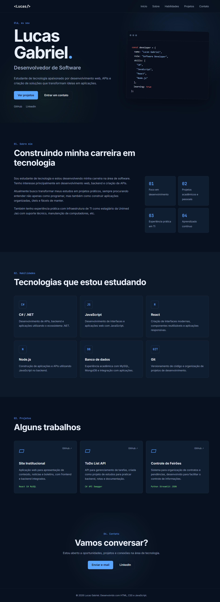
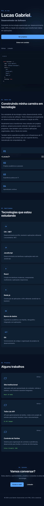
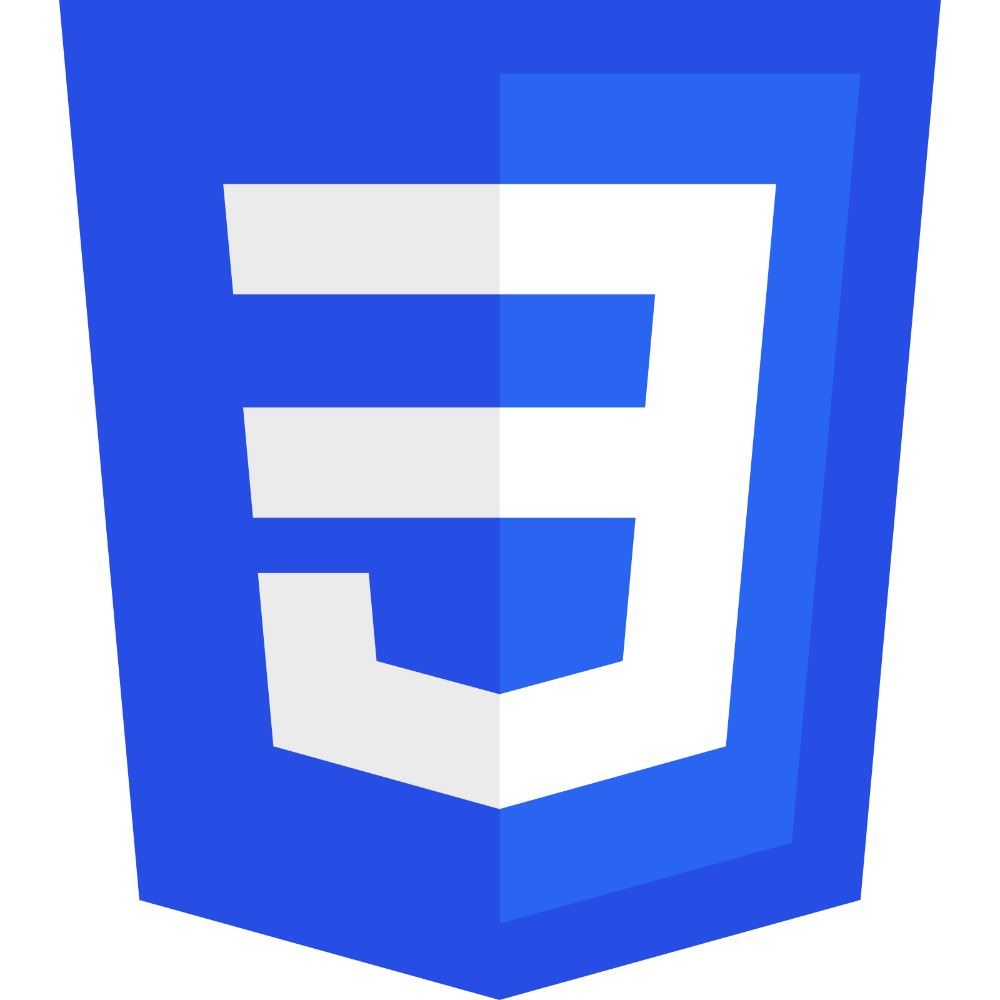

# Portfólio - Lucas Gabriel

Site portfolio sobre mim com projetos e contato (Desenvolvido com auxílio IA)

Acesse o site: <a href="https://lucasgabriel2806.github.io/portfolio/" target="_blank">Portfólio - Lucas Gabriel</a>

  

## Desktop

    

## Mobile

  

## Tecnologias utilizadas
<table>
  <tr>
    <td width="50">
      
    </td>
    <td>
      HTML: Estrutura da página web
    </td>
  </tr>

  <tr>
    <td width="50">
      
    </td>
    <td>
      CSS: Estilo da página web
    </td>
  </tr>

  <tr>
    <td width="50">
      
    </td>
    <td>
      JavaScript: Comportamento da página web
    </td>
  </tr>

</table>